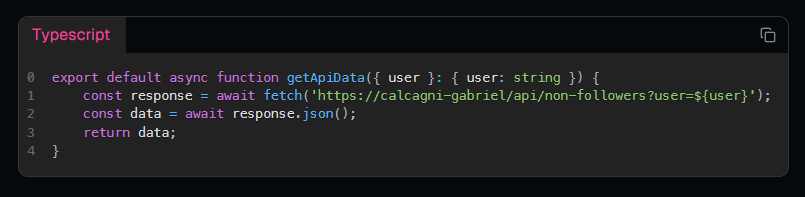

# Clean Indent


## Descripción

**clean-indent** es una utilidad ligera y eficiente para limpiar las indentaciones de cadenas de código. Ideal para formatear textos y asegurarte de que no queden espacios innecesarios al inicio o al final de cada línea. Ideal para presentaciones de código dentro de los elementos `<pre>`.

## Características

- **Fácil de usar**: Simplemente pasa la cadena que quieres limpiar.
- **Ligera**: Sin dependencias adicionales.
- **Rápida**: Procesa incluso cadenas grandes rápidamente.
- **Compatibilidad**: Funciona con Node.js y navegadores.
- **Especializada**: Esta utilidad está principalmente diseñada para preparar fragmentos de código para su presentación en el renderizado del HTML `<pre>`, para limpiar las indentaciones y formatear el código.

## Instalación

Puedes instalar este paquete usando npm, pnpm o yarn:

### npm

```sh
npm install clean-indent
```

### pnpm

```sh
pnpm install clean-indent
```

### yarn

```sh
yarn install clean-indent
```

### Ejemplo de uso

- Componente:

```typescript
import cleanIndent from 'clean-indent';

export const Pre = (lang: string, stringCode: string) => {
  return (
    <pre lang={lang}>
      {cleanIndent(stringCode)}
    </pre>
  );
};
```

- Uso estándar del componente:

```typescript
import { Pre } from '@/components/Pre';

export default function Page() {
  return (
    <main>
      <Pre lang="typescript">
        {`
          async function getData() {
            const url = 'https://solid-geolocation.vercel.app/location';
            const response = await fetch(url);
            const jsonData = await response.json();
            return jsonData;
          }
        `}
      </Pre>
    </main>
  );
}
```

### Aquí les dejo este componente que he creado en React más completo con otras dependencias:

Instalamos el resaltador prism-reac-renderer y los íconos, en este caso lucide y la la herramienta para limpiar las indentaciones o espacios que no correspondan.

```sh
pnpm install prism-react-renderer lucide-react clean-indent
```

```tsx
import { useMemo, useRef, useState } from 'react';
import styles from './pre.module.css';
import { Highlight, themes } from 'prism-react-renderer';
import { Copy, CopyCheck } from 'lucide-react';
import cleanIndent from 'clean-indent';

interface PreProps {
  stringCode: string;
  lang: string;
}

export const Pre = ({ stringCode, lang }: PreProps) => {
  const code = useMemo(() => stringCode, [stringCode]);
  const content = useRef<HTMLPreElement>();
  const [copied, setCopied] = useState(false);

  const copyCode = async () => {
    if (!content.current) return;

    try {
      await navigator.clipboard.writeText(content.current.textContent || '');
      setCopied(true);

      setTimeout(() => setCopied(false), 2000);
    } catch (err) {
      console.error('Error al copiar en el portapapeles:', err);
    }
  };

  return (
    <Highlight code={code} theme={themes.oneDark} language={lang}>
      {({ tokens, getLineProps, getTokenProps }) => (
        <pre className={styles.custom_pre} ref={content as any}>
          <span className={styles.icon} onClick={copyCode}>
            {copied ? (
              <CopyCheck width={16} height={16} className={styles.copied} />
            ) : (
              <Copy className="cursor-pointer" width={16} height={16} />
            )}
          </span>
          {tokens.map((line, lineIndex) => (
            <code {...getLineProps({ line })} key={lineIndex + 1}>
              <span className={styles.line_number} key={lineIndex}>
                {lineIndex}
              </span>
              {line.map((token, tokenIndex) => (
                <span
                  key={tokenIndex}
                  {...getTokenProps({ token })}
                  className={styles.line_content}
                />
              ))}
            </code>
          ))}
        </pre>
      )}
    </Highlight>
  );
};
```

- Uso del componente:

```tsx
import { Pre } from '@/components/Pre'

export default function Page() {
  return (
    <Pre
        lang="typescript"
        stringCode={`
        export default async function getApiData({ user }: { user: string }) {
            const response = await fetch('https://calcagni-gabriel/api/non-followers?user=\${user}');
            const data = await response.json();
            return data;
        }
      `}
    />
  )
}
```

### Imagen del componente

<div>
  
</div>

---

<div align="center">
solidsnk86 • 2025
</div>
